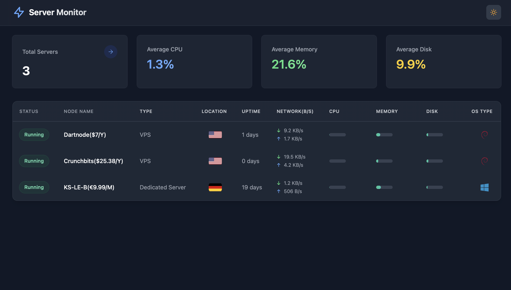

# Server Monitor

[](https://opensource.org/licenses/MIT)
[](https://www.python.org/downloads/)
[](https://nodejs.org/)
[](https://nextjs.org/)
[](https://flask.palletsprojects.com/)
[](https://github.com/wanghui5801/Monitor-nextjs)



A user-friendly, real-time monitoring system for distributed servers with an intuitive dashboard interface.

## Key Features

✨ Real-time System Metrics:
- CPU usage & model information
- Memory utilization
- Disk space monitoring
- Automatic location detection
- Network traffic monitoring

🌟 Additional Features:
- Multi-server management
- Automatic status detection
- Cross-platform (Windows/Linux)
- Dark/Light mode
- One-click installation

## Quick Installation Guide

### 1. Server Setup (Linux Only)

Run this command on your Linux server:

```bash
wget -O install.sh https://raw.githubusercontent.com/wanghui5801/Monitor-nextjs/main/install_server.sh && chmod +x install.sh && sudo ./install.sh
```

After installation, access:
- Dashboard: `http://YOUR_SERVER_IP`
- API: `http://YOUR_SERVER_IP:5000`

### 2. Client Installation

#### For Linux:

```bash
wget -O install.sh https://raw.githubusercontent.com/wanghui5801/Monitor-nextjs/main/install_client.sh && chmod +x install.sh && sudo ./install.sh
```

#### For Windows:
Run PowerShell as Administrator:

```powershell
Invoke-WebRequest -Uri 'https://raw.githubusercontent.com/wanghui5801/Monitor-nextjs/main/install_client.bat' -OutFile 'install_client.bat'; .\install_client.bat
```

## System Requirements

### Server
- OS: Ubuntu/Debian/CentOS/RHEL/Fedora
- Python 3.8+
- Node.js 18+
- 1GB RAM minimum
- 10GB free disk space

### Client
- OS: Windows/Linux
- Python 3.8+
- 100MB free disk space
- Admin/Root privileges

## Development Setup

1. Clone and prepare:

```bash
git clone https://github.com/wanghui5801/Monitor-nextjs.git
cd Monitor-nextjs
```

2. Setup Frontend:

```bash
cd frontend
npm install
npm run dev
```

3. Setup Backend:

```bash
cd backend
python -m venv venv
source venv/bin/activate  # Windows: .\venv\Scripts\activate
pip install -r requirements.txt
python app.py
```

## Configuration

### Server
- API Port: 5000
- Frontend Port: 3000 (dev) / 80 (prod)
- Database: SQLite3 (/opt/server-monitor/backend/monitor.db)

### Client
- Update Interval: 2 seconds
- Auto-restart: Enabled
- API Endpoint: http://YOUR_SERVER_IP:5000

## Service Management

### Server (PM2)

Monitor server status:

```bash
sudo pm2 status
```

View logs:

```bash
sudo pm2 logs                    # All logs
sudo pm2 logs server-monitor-frontend  # Frontend logs only
sudo pm2 logs server-monitor-backend   # Backend logs only
```

Restart services:

```bash
sudo pm2 restart all            # Restart all
sudo pm2 restart server-monitor-frontend
sudo pm2 restart server-monitor-backend
```

Stop services:

```bash
sudo pm2 stop all              # Stop all
sudo pm2 stop server-monitor-frontend
sudo pm2 stop server-monitor-backend
```

### Client Service

#### Linux (Systemctl)

Check status:

```bash
sudo systemctl status server-monitor-client
```

View logs:

```bash
sudo journalctl -u server-monitor-client -f
```

Manage service:

```bash
sudo systemctl start server-monitor-client
sudo systemctl stop server-monitor-client
sudo systemctl restart server-monitor-client
```

#### Windows (Services)

Using Command Prompt (Admin):

```cmd
net start ServerMonitorClient
net stop ServerMonitorClient
```

Or using PowerShell (Admin):

```powershell
Start-Service ServerMonitorClient
Stop-Service ServerMonitorClient
Restart-Service ServerMonitorClient
Get-Service ServerMonitorClient
```

View logs at:
```
C:\server-monitor-client\logs\service.log
C:\server-monitor-client\logs\error.log
```

## Support

For issues or feature requests, please open an issue on GitHub.

## License

MIT License - see LICENSE file for details